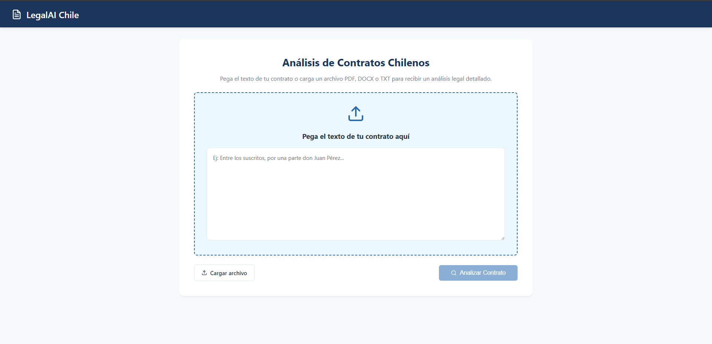
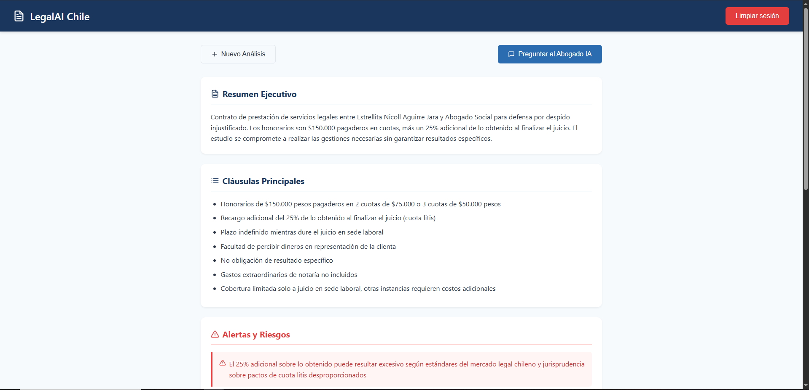
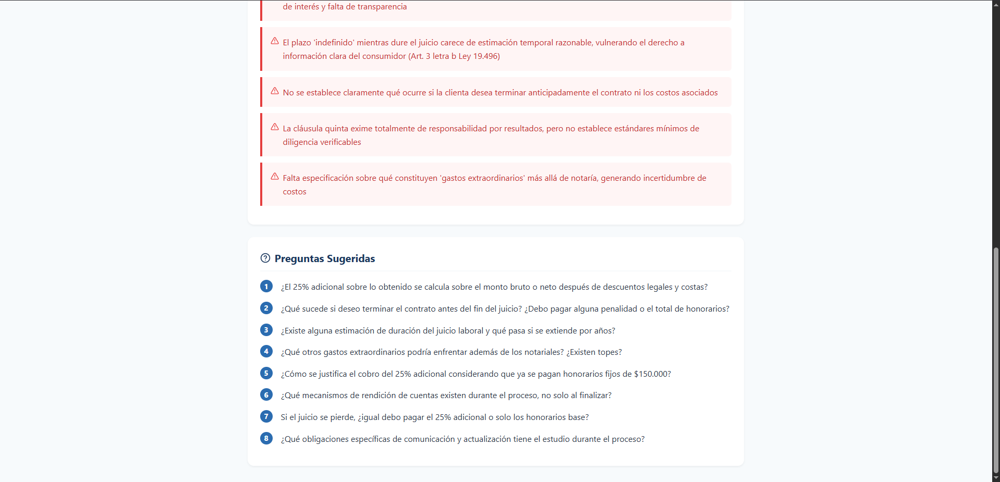
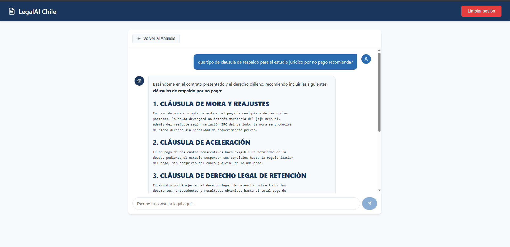

# LegalAI Chile — Analizador de Contratos


Aplicación web que analiza contratos chilenos usando inteligencia artificial. El usuario sube o pega el texto de un contrato y recibe un análisis legal estructurado basado en el Código Civil chileno, Código del Trabajo y Ley del Consumidor 19.496.

## Screenshots

| Inicio | Análisis |
|--------|---------|
|  |  |

| Alertas y preguntas | Chat legal |
|--------------------|-----------|
|  |  |

## Stack

| Capa | Tecnología |
|------|-----------|
| Frontend | React 19 · Vite · Axios · React Icons · React Markdown |
| Backend | FastAPI · Python 3.12 |
| IA | Claude Sonnet (Anthropic API) |
| Parsing | PyMuPDF (PDF) · python-docx (Word) |

## Funcionalidades

- Pegar texto o subir archivos PDF, DOCX o TXT
- Análisis automático con 4 secciones estructuradas:
  - Resumen ejecutivo en lenguaje simple
  - Cláusulas importantes del contrato
  - Alertas de riesgo según normativa chilena
  - Preguntas sugeridas para el abogado
- Chat de consultas sobre el contrato analizado
- Persistencia de sesión con localStorage
- Markdown renderizado en respuestas del chat

## Arquitectura

```
contrato-analyzer/
├── backend/
│   ├── main.py              # FastAPI + endpoints de análisis y chat
│   ├── requirements.txt
│   └── .env                 # ANTHROPIC_API_KEY (no incluido)
└── frontend/
    └── src/
        ├── App.jsx           # Estado global + localStorage
        ├── components/
        │   ├── UploadView.jsx    # Carga de contrato
        │   ├── AnalysisView.jsx  # Resultados del análisis
        │   └── ChatView.jsx      # Chat con el asistente
        └── index.css
```

## Endpoints API

| Método | Ruta | Descripción |
|--------|------|-------------|
| `POST` | `/api/analyze` | Analiza el contrato y retorna JSON estructurado |
| `POST` | `/api/chat` | Responde preguntas sobre el contrato |
| `POST` | `/api/upload` | Extrae texto de PDF, DOCX o TXT |
| `GET` | `/api/health` | Estado del servidor |

## Decisiones técnicas

**Contexto legal chileno en el system prompt:** El modelo recibe instrucciones específicas para analizar según el Código Civil, Código del Trabajo y Ley del Consumidor 19.496. Esto diferencia el análisis de un prompt genérico y mejora significativamente la relevancia de las alertas detectadas.

**Respuesta JSON forzada:** El endpoint `/api/analyze` instruye al modelo a retornar únicamente JSON con keys exactas. Incluye limpieza de bloques markdown por si el modelo los agrega igualmente, garantizando un parseo confiable.

**Contrato como contexto en el chat:** En `/api/chat` el texto del contrato se inyecta en el primer mensaje del historial usando etiquetas XML (`<contrato_contexto>`). Esto es una práctica recomendada por Anthropic para separar datos de instrucciones.

**localStorage para persistencia:** El análisis y el historial del chat persisten entre recargas de página sin necesidad de base de datos. El usuario puede volver a revisar su análisis sin necesidad de resubir el contrato.

**Separación frontend/backend:** El frontend usa un proxy Vite en desarrollo (`/api` → `localhost:8000`), lo que permite cambiar la URL del backend en producción con una sola variable de entorno.

## Instalación

### Requisitos
Python 3.12+, Node.js 18+, API key de Anthropic

### Backend

```bash
cd backend
python3 -m venv venv
source venv/bin/activate
pip install -r requirements.txt
cp .env.example .env
# Agrega tu ANTHROPIC_API_KEY en .env
uvicorn main:app --reload
```

### Frontend

```bash
cd frontend
npm install
npm run dev
```

Abrir `http://localhost:5173`

## Autor

**Buildirnite** · [github.com/Buildirnite](https://github.com/Buildirnite)

---
